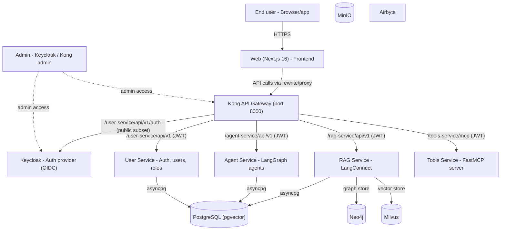
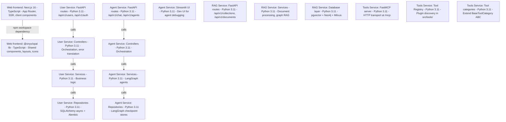
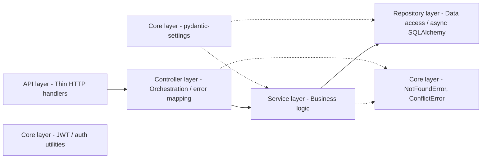

# Architecture Overview

## System context



## Container diagram



## Authorization Model

User-service owns runtime authorization. Services and the web app check named
permissions, and user-service resolves the caller's effective permission set
from local RBAC data.

- Users can hold multiple composite roles through `user_roles`.
- `users.role` is a derived primary-role mirror for legacy readers and
  Keycloak realm-role sync.
- Composite roles aggregate direct permissions and feature bundles stored in
  `role_ids`.
- The `system-admin` wildcard role resolves to `["*"]`.
- `users.is_superuser` is not part of authorization.

## Python service layered architecture



**Layer rules:**
- Routes parse HTTP params, call controller, return response. No business logic.
- Controllers orchestrate services, translate domain errors to HTTP statuses.
- Services are pure domain logic. Raise domain exceptions from `core/exceptions.py`.
- Repositories wrap SQLAlchemy async sessions. Each entity has its own repo.
- Config loaded via `pydantic-settings` `BaseSettings` with `@lru_cache`.
- Services/controllers: `_instance` module var + `get_*()` singleton pattern.

## Development lifecycle

```mermaid
flowchart LR
  Start([Start])
  Understand["Load skill + read AGENTS.md"]
  Code["Follow layered architecture"]
  Test["make test / npm test"]
  Lint["make lint"]
  Typecheck["make typecheck / npm run types:check"]
  Validate["make validate"]
  QualityGate["make quality-staged"]
  Push["make quality-push"]
  Done([Done])

  Start --> Understand
  Understand --> Code
  Code --> Test
  Test --> Lint
  Lint --> Typecheck
  Typecheck --> Validate
  Validate --> QualityGate
  QualityGate --> Push
  Push --> Done
```



## Infrastructure & startup

```mermaid
flowchart LR
  env_init["1. Env setup: make env-init"]
  env_check["1. Env setup: make env-check"]
  dc_services["2. Infrastructure: docker compose up"]
  PG["Postgres"]
  Neo4j["Neo4j"]
  Milvus["Milvus"]
  Airbyte["Airbyte"]
  KC["Keycloak"]
  dc_dev["3. App services: docker compose up"]
  User["User Service"]
  Agent["Agent Service"]
  RAG["RAG Service"]
  Tools["Tools Service"]
  Kong["Kong Gateway"]

  env_init --> env_check
  env_check --> dc_services

  dc_services --> PG
  dc_services --> Neo4j
  dc_services --> Milvus
  dc_services --> Airbyte
  dc_services --> KC

  dc_services --> dc_dev

  Kong --> User
  Kong --> Agent
  Kong --> RAG
  Kong --> Tools

  User --> PG
  Agent --> PG
  RAG --> PG
   RAG --> Neo4j
   RAG --> Milvus

## Agent service composition

Agents in the agent-service are composed from explicit components (brain,
perceptrons, tool gateway, graph schema, runtime policies) through the
`agent_composition` package — `AgentFactory` → `AgentComposer` → `ComposedAgent`
— rather than monolithic agent modules. Built-in agents are recipes; LangGraph
Studio graphs are exposed from `src/agents/studio_graphs.py`. See
[docs/agent-composition.md](agent-composition.md) for the full runtime
reference and the list of legacy modules removed in ASC-7.

```
