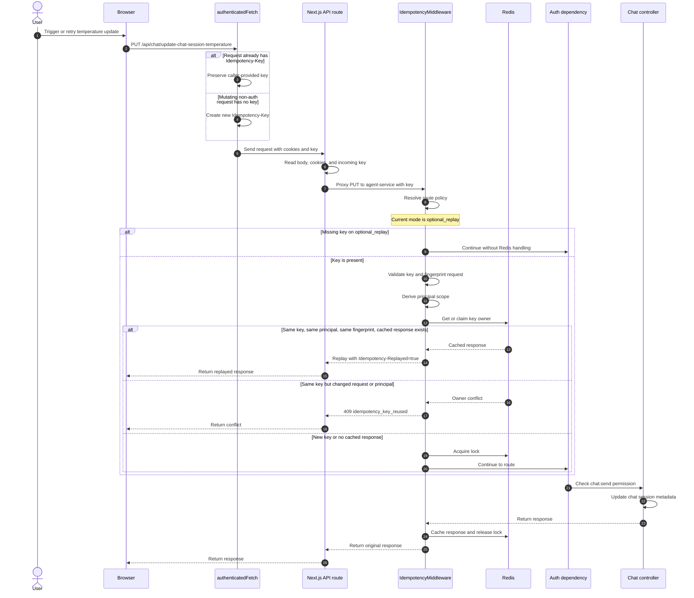

# Idempotency

This document explains how idempotency works in this repository, where the
implementation lives, and what you must update when you add or change mutating
API endpoints. It is written for developers who are new to the project and need
to understand the request flow before making changes.

Idempotency is implemented as a shared HTTP middleware for the Python services.
The middleware deduplicates retryable mutating requests by using an
`Idempotency-Key` header, a stable request fingerprint, a principal scope, and
Redis-backed locks and cached responses.

## Quick mental model

Think of an `Idempotency-Key` as the client-generated operation ID. The backend
accepts that operation ID only for one principal and one exact HTTP request. If
the same operation arrives again, the service either returns the first response
or refuses to run the side effect again.

The implementation has three layers:

- The shared package defines the reusable middleware, Redis storage model, and
  policy types.
- Each backend service defines which of its routes require idempotency and which
  routes can use replay only when a caller supplies a key.
- The web app creates and forwards keys so browser retries, token-refresh
  retries, and visible user retries use the same operation ID.

## What idempotency guarantees

Idempotency protects clients and services from running the same logical
operation more than once when a request is retried. A retry can happen because a
browser retries an action, a token refresh repeats a request, a network timeout
hides a successful response, or a user-visible retry button sends the operation
again.

The current implementation guarantees these behaviors when a request supplies an
`Idempotency-Key` and the route policy enables idempotency handling:

- The same key, principal, method, path, query string, content type, and request
  body replays the cached response when replay is safe.
- The same key with a different request fingerprint returns
  `409 idempotency_key_reused`.
- The same key from a different principal returns
  `409 idempotency_key_reused`.
- A concurrent duplicate waits briefly for the first request to finish and then
  replays the cached response when one is available.
- A non-replayable high-risk operation doesn't execute twice. The middleware
  marks the key as completed without replay and returns a conflict on reuse.

The middleware doesn't replace database constraints, transactional writes, or
domain-level duplicate detection. Use those protections for invariants that must
hold even when idempotency is disabled, Redis is unavailable in optional mode, or
traffic bypasses the HTTP middleware.

## Code map

Start with these files when you need to understand or change idempotency.

| Area | File | Purpose |
|---|---|---|
| Shared middleware | `packages/idempotency-py/src/idempotency/middleware.py` | Reads the request, validates the key, builds the fingerprint, claims ownership, manages locks, caches responses, and returns replay or conflict responses. |
| Shared Redis operations | `packages/idempotency-py/src/idempotency/storage.py` | Defines Redis key shapes and atomic lock claim, renew, and release operations. |
| Shared models | `packages/idempotency-py/src/idempotency/models.py` | Defines policy modes, route policy matching, cached response metadata, and key owner metadata. |
| Shared config | `packages/idempotency-py/src/idempotency/config.py` | Defines TTLs, lock settings, cache settings, Redis settings, principal header candidates, and the optional `principal_extractor` callback. |
| Agent policy | `apps/agent-service/src/core/idempotency.py` | Classifies agent-service mutating routes by idempotency mode and wires the JWT principal extractor. |
| RAG policy | `apps/rag-service/langconnect/idempotency.py` | Classifies rag-service mutating routes by idempotency mode and wires the JWT principal extractor. |
| User policy | `apps/user-service/src/core/idempotency.py` | Classifies user-service mutating routes by idempotency mode and wires the JWT principal extractor. |
| Tools policy | `apps/tools-service/src/core/idempotency.py` | Classifies tools-service HTTP transport routes. |
| Agent principal | `apps/agent-service/src/core/idempotency_principal.py` | Extracts the principal scope from the verified Keycloak JWT `sub` claim for agent-service. |
| User principal | `apps/user-service/src/core/idempotency_principal.py` | Extracts the principal scope from the verified Keycloak JWT `sub` claim for user-service. |
| RAG principal | `apps/rag-service/langconnect/idempotency_principal.py` | Extracts the principal scope from the verified Keycloak JWT `sub` claim for rag-service. |
| Agent registration | `apps/agent-service/src/app.py` | Adds `IdempotencyMiddleware` to agent-service. |
| RAG registration | `apps/rag-service/langconnect/server.py` | Adds `IdempotencyMiddleware` to rag-service. |
| User registration | `apps/user-service/src/main.py` | Adds `IdempotencyMiddleware` to user-service. |
| Tools registration | `apps/tools-service/server.py` | Adds `IdempotencyMiddleware` to the FastMCP HTTP app. |
| Web helpers | `apps/web/src/lib/api/idempotency.ts` | Creates UUID keys, attaches keys to outgoing requests, and forwards incoming keys from Next.js routes. |
| Web backend forwarding | `apps/web/src/lib/api/backendResponse.ts` | Forwards the backend status code and `Idempotency-Replayed` header from Next.js proxy routes. |
| Web key hook | `apps/web/src/hooks/useIdempotencyKey.ts` | Returns a stable idempotency key per operation boundary, stored in `sessionStorage` so it survives refresh/remount. |
| Authenticated fetch | `apps/web/src/lib/fetcher.ts` | Automatically adds an idempotency key to mutating, non-auth browser requests when the caller didn't provide one. |
| API proxy | `apps/web/src/lib/api/proxy.ts` | Forwards incoming idempotency keys from Next.js API routes to backend services for mutating, non-auth requests. |

## Runtime flow

The request flow is the same across the Python services because they share the
same middleware package.

1. The service registers `IdempotencyMiddleware` during app startup.
2. The middleware skips the request when idempotency is disabled, the method is
   not `POST`, `PUT`, `PATCH`, or `DELETE`, or the path is excluded.
3. The middleware resolves the route policy for the request method and path.
4. If the route requires a key and the request doesn't include
   `Idempotency-Key`, the middleware returns
   `400 idempotency_key_required`.
5. If a key is present, the middleware validates it before talking to Redis. A
   key must be 1-255 characters and can contain only letters, digits, `.`, `_`,
   or `-`.
6. The middleware reads the request body and creates a request fingerprint from
   method, path, query string, content type, and the SHA-256 hash of the body.
7. The middleware derives a principal scope. When the service configures a
   `principal_extractor`, the middleware calls it to get the authenticated
   user's identity from the verified JWT `sub` claim, hashes that value, and
   falls back to `anonymous` when no identity is available. When no extractor
   is configured (internal service-to-service calls), the middleware falls back
   to scanning configured identity headers.
8. Redis stores an owner record for the idempotency key. The owner record binds
   the key to one principal scope and one request fingerprint.
9. If a compatible cached response already exists, the middleware returns that
   response and adds `Idempotency-Replayed: true`.
10. If no cached response exists, the middleware acquires a Redis lock for that
    service, principal, and key.
11. While the request runs, a background task renews the lock at about one-third
    of `lock_ttl`.
12. After the route handler returns, the middleware caches cacheable responses
    whose bodies fit under `max_cache_body_size`.
13. The middleware releases the lock with an atomic compare-and-delete script so
    it doesn't delete a lock owned by another request.

Redis uses three logical records:

- `owner`: binds an `Idempotency-Key` to a principal and fingerprint for the
  configured TTL.
- `lock`: prevents concurrent execution of the same service, principal, and key.
- `response`: stores replayable response metadata and a base64-encoded body.

## Request fingerprint and principal scope

The fingerprint is intentionally request-specific. Reusing a key for another
payload, route, query string, or content type is treated as a client error and
returns `409 idempotency_key_reused`.

The principal scope prevents one user or service caller from replaying another
caller's response with the same key.

For authenticated browser traffic, each service configures a
`principal_extractor` callback on `IdempotencyConfig`. The middleware calls the
extractor with the request and uses the returned identity as the principal
scope. The extractor decodes the verified Keycloak JWT and returns the `sub`
claim (the Keycloak subject ID). This means the principal scope is derived from
the verified token, not from client-supplied headers.

Client-supplied `X-User-Id` and `X-Authenticated-User-Id` headers are never
trusted for principal scope when an extractor is configured. A malicious client
cannot set an arbitrary principal scope by spoofing these headers.

When the extractor returns `None` (for example, a malformed or missing token),
the middleware falls back to the `anonymous` scope. This is safe because route
authentication runs after the middleware and rejects unauthenticated requests
before any business logic executes.

For internal service-to-service calls that don't carry a user JWT (for example,
agent-service to tools-service), the service may omit the extractor and rely on
the header-based fallback. Tools-service keeps the header-based principal using
`X-Internal-Service-Token` for these internal calls.

The raw principal value is not stored in Redis. The middleware stores a SHA-256
hash of the value.

## Policy modes

Each service classifies mutating routes with an `IdempotencyPolicyConfig`.
Policy paths use the service's versioned API prefix, not Kong routes, hostnames,
or ports.

| Mode | Missing key behavior | Replay behavior | Use for |
|---|---|---|---|
| `excluded` | Ignored | No idempotency handling | Auth browser flows and endpoints where replay is incorrect. |
| `optional_replay` | Allowed | A supplied key enables replay and conflict detection | Low-risk mutations and compatibility paths where mandatory keys would break clients. |
| `required_replay` | Required (enforced by default) | Replay cached deterministic responses | Deterministic creates and updates where returning the same response is safe. |
| `domain_required` | Always required | Replay when safe, or mark completed without replay | High-risk side effects such as streaming, uploads, external calls, job starts, email sends, tool execution, syncs, and destructive admin cleanup. |

`IDEMPOTENCY_ENFORCE_REQUIRED_KEYS` defaults to `true` in every service, so
`required_replay` routes reject missing keys by default. This is safe because
all mutating endpoints in this system are authorized and the frontend already
attaches keys to all mutating requests. The one exception is tools-service's
`/mcp` route, which keeps `enforce_missing_key=False` because FastMCP streamable
HTTP sessions issue multiple protocol POSTs over one connection that can't share
a single static key.

`domain_required` is the safest mode for non-idempotent side effects because the
route rejects missing keys even when global required-key enforcement is off.

## Choosing a mode

Choose the mode from the operation's side effects, not only from the HTTP
method. A `PUT` can be safe to replay when it updates local metadata, but risky
when it triggers a provider sync, sends a notification, or starts a background
job.

Use this decision guide when you classify a route:

1. Use `excluded` when the middleware must not participate. This is usually for
   login, refresh, logout, browser auth callbacks, or flows that mint or rotate
   credentials.
2. Use `domain_required` when duplicate execution is dangerous and response
   replay is not always enough. This includes external side effects, streaming
   responses, tool calls, email sends, file uploads, sync jobs, model pulls,
   graph builds, and destructive admin actions.
3. Use `required_replay` when the operation is deterministic and replaying the
   first response is correct. This fits creates and updates where the cached
   response body is small and stable.
4. Use `optional_replay` only when missing keys are acceptable. This fits
   backward-compatible low-risk mutations and read-like `POST` routes.

If you are unsure, start with `domain_required` for high-risk side effects and
`required_replay` for deterministic local writes. Treat default
`optional_replay` as a conscious compatibility choice, not as complete
protection.

## Active usage patterns

The backend can only deduplicate operations that arrive with the same
`Idempotency-Key`. To actively use the model, decide the logical operation
boundary and keep one key for that boundary.

### Immediate user action

For a button click, form submit, slider commit, or menu action, create one key
when the user commits the action. Reuse that key for automatic retries of the
same action. Create a new key for the next user action.

Good examples:

- The user clicks **Create assistant** once and the frontend retries after a
  temporary network failure with the same key.
- The user commits a model setting update once and token refresh repeats the
  same request with the same key.

Don't create a new key inside every render, effect run, or polling tick for the
same operation.

### Refresh-safe operation

When an operation must survive page refresh or remount, store the key outside
the component instance. Good storage locations include URL state, a mutation
store, session storage, local storage, or server-side job state.

Use this for operations where a refresh can happen before the client receives
the final response:

- file uploads;
- model pulls;
- datasource syncs;
- graph builds;
- long-running tool execution;
- streaming operations with side effects.

The client must remove or rotate the stored key when the operation reaches a
terminal state or the user intentionally starts a new operation.

### Background job start

For routes that start jobs, use `domain_required` and make the job identity
visible to the caller. The first request can create the job and return the job
ID. A retry with the same key must not create another job.

If the response is cacheable, the middleware can replay the first response. If
the response is not cacheable, the domain must provide a way for the client to
query the existing job by returned job ID, operation ID, or domain key.

### Streaming operation

For server-sent events and other streaming responses, don't rely on response
replay. Use `domain_required` so reuse of the same key doesn't start the side
effect again.

The client must treat a retry conflict as "the original operation already ran
or is running" and then recover through domain state, such as run status, chat
history, upload status, or job status.

### Idempotent domain write

For deterministic writes, pair HTTP idempotency with domain constraints. For
example, a create route can use `required_replay` and also enforce a unique
domain key in the database. That gives protection even if Redis is temporarily
unavailable for an optional route or another internal caller bypasses the HTTP
edge.

## Service policies

Service policy files are the source of truth for classifying backend routes.
When you add a new mutating route, update the owning service policy in the same
change.

### Agent service

Agent-service uses `apps/agent-service/src/core/idempotency.py`.

High-risk `domain_required` routes include chat message sends, agent invokes and
streams, MCP execution, datasource sync, ingestion, file upload, mail test and
send, model sync, Ollama pull, web crawl, persona image upload, and selected
destructive Ollama model cleanup.

Deterministic create routes such as chat sessions, threads, assistants,
personas, agent definitions, agent groups, datasources, MCP providers,
providers, user providers, projects, and datasource schedules are classified as
`required_replay`.

Several mutating routes still rely on `optional_replay`, either explicitly or by
default. Review defaulted routes carefully before treating coverage as complete.

### RAG service

RAG-service uses `apps/rag-service/langconnect/idempotency.py`.

High-risk `domain_required` routes include graph builds, graph build lifecycle
actions, document creation, force collection delete, and graph collection
delete. Collection creation and collection update use `required_replay`.

Search, Cypher, regular collection delete, and regular document delete are
currently `optional_replay`. Document upload-job start and retrieval currently
fall through to default `optional_replay`.

### User service

User-service uses `apps/user-service/src/core/idempotency.py`.

Auth login, external login, logout, and refresh are `excluded`. User invite,
password reset, password set, permission sync, Keycloak role sync, external IdP
sync, user sync, and API key creation are `domain_required`.

Registration, user creation, role creation, coarse-role creation, organization
creation, organization membership assignment, memory creation, prompt shortcut
creation, and role permission updates use `required_replay`.

Many role, permission, organization, internal user, internal memory, and user
role mutations currently fall through to default `optional_replay`. Review those
routes before assuming retries are fully protected without a caller-supplied
key.

### Tools service

Tools-service uses `apps/tools-service/src/core/idempotency.py`.

The direct `/mcp` route is classified as `domain_required`, but it deliberately
doesn't enforce a missing key. FastMCP streamable HTTP sessions issue multiple
protocol `POST` requests over one logical session, so a static
`Idempotency-Key` cannot represent a single tool operation at the transport
level. When a key is supplied, the middleware still applies conflict detection
and replay handling.

Agent-service's `/api/v1/proxy/mcp/execute` route is the preferred place to
require operation-level idempotency for tool execution.

## Frontend behavior

The frontend has two responsibilities: generate stable keys for retryable
operations and forward keys through proxy routes.

Use `createIdempotencyKey()` when a new user action starts a retryable mutation.
If the user retries the same visible operation, reuse the same key. If the user
starts a new operation, create a new key.

Idempotency only works across retries when the client reuses the same key. If a
page refresh, remount, polling loop, or effect creates a new key for the same
unchanged request, the backend treats it as a new logical operation and won't
look up the previous cached response. Store the operation key in the component
state, URL state, local state manager, or request retry context when a user
needs the same operation to survive a refresh or remount.

Use `withIdempotencyKey()` when a caller needs to attach a known key to a
request. Next.js API routes can use `getIncomingIdempotencyHeaders()` to forward
the key they received from the browser.

For operations that must survive a page refresh or remount, use the
`useIdempotencyKey(operationId)` hook. It returns a stable key stored in
`sessionStorage` keyed by an operation boundary, plus a `clearKey()` function to
remove the key when the operation reaches a terminal state. This ensures a
refresh within the same browser session recovers the same key instead of
generating a new one that bypasses backend deduplication.

```tsx
const { key, clearKey } = useIdempotencyKey("create-assistant");

const onSubmit = async () => {
  await authenticatedFetch("/api/assistants", {
    method: "POST",
    headers: withIdempotencyKey({}, key),
    body: JSON.stringify(payload),
  });
  clearKey(); // operation reached a terminal state
};
```

`authenticatedFetch` automatically adds a key to mutating, non-auth requests
that don't already provide one. It keeps that key on the request options, so a
retry after token refresh sends the same key instead of creating a second
logical operation.

Next.js proxy routes forward `Idempotency-Key` for mutating requests except auth
login, refresh, logout, and OIDC browser auth flows. They also forward the
backend's HTTP status code and the `Idempotency-Replayed` header via
`forwardBackendResponse()`, so the frontend can detect idempotency conflicts
(`409`) and missing-key errors (`400`) instead of always receiving `200`.

## Example request lifecycle

This section follows
`PUT /api/chat/update-chat-session-temperature` from the browser to the backend.
Use this as a concrete map for debugging similar requests.



### Browser to frontend API route

The browser usually calls the endpoint through `authenticatedFetch`. The helper
checks the HTTP method before the request leaves the app:

1. `authenticatedFetch` receives the request options.
2. `attachIdempotencyKey()` checks whether the method is `POST`, `PUT`,
   `PATCH`, or `DELETE`.
3. If the request is mutating, isn't an excluded auth route, and doesn't already
   include `Idempotency-Key`, it creates a new key with
   `createIdempotencyKey()`.
4. The helper calls `fetch()` with `credentials: "include"` so browser cookies
   are sent.
5. If the response is `401`, `authenticatedFetch` attempts token refresh and
   retries the same request options. That retry reuses the same key.

The relevant files are:

- `apps/web/src/lib/fetcher.ts`
- `apps/web/src/lib/api/idempotency.ts`
- `apps/web/src/app/app/services/lib.tsx`

### Frontend API route to agent-service

The Next.js API route receives the browser request and proxies it to
agent-service:

1. The route reads the request body.
2. The route reads the browser `cookie` header.
3. The route reads the incoming `Idempotency-Key` with
   `getIncomingIdempotencyHeaders()`.
4. The route calls backend `fetch()` and forwards `Content-Type`, the
   idempotency key when present, and the cookie when present.

The relevant file is:

- `apps/web/src/app/api/chat/update-chat-session-temperature/route.ts`

This route uses raw `fetch()` because it runs on the server side and is proxying
an already-authenticated browser request. It must preserve the incoming
operation key instead of generating a second key.

### Agent-service middleware and route handling

Agent-service registers `IdempotencyMiddleware` in its FastAPI app. The
middleware runs before route dependencies and controller logic.

For this endpoint, the backend flow is:

1. The middleware sees a `PUT` request and doesn't skip it.
2. The middleware resolves
   `/api/v1/chat/update-chat-session-temperature` from the agent-service policy.
3. The route currently resolves to `optional_replay`.
4. If no key is present, the middleware lets the request continue without Redis
   replay or conflict handling.
5. If a key is present, the middleware validates the key, builds the request
   fingerprint, derives the principal scope, and checks Redis.
6. If Redis has a matching cached response, the middleware returns it with
   `Idempotency-Replayed: true` and the route handler doesn't run.
7. If Redis doesn't have a cached response, the middleware acquires a lock and
   lets the FastAPI route run.
8. The route dependency checks auth and permissions with
   `require_permission("chat:send")`.
9. The route reads the JSON body and calls the chat controller.
10. The controller updates the chat session metadata when the authenticated user
    owns the session.
11. The middleware caches the response when it is cacheable and releases the
    lock.

The relevant files are:

- `apps/agent-service/src/app.py`
- `apps/agent-service/src/core/idempotency.py`
- `apps/agent-service/src/api/routes/ChatRoute.py`
- `apps/agent-service/src/controller/chat_controller.py`

### Case matrix

Use this table to reason about what happens for the same endpoint.

| Case | Request input | Expected behavior |
|---|---|---|
| First request with key | Same method, path, body, user, and a new `Idempotency-Key` | Middleware claims the key, route runs, response can be cached. |
| Retry with same key | Same method, path, body, user, and same `Idempotency-Key` | Middleware returns cached response with `Idempotency-Replayed: true` when the response is replayable. |
| Retry with new key | Same method, path, body, and user, but a new `Idempotency-Key` | Middleware treats it as a new logical operation and the route can run again. |
| Same key, changed body | Same user and path, but changed body | Middleware returns `409 idempotency_key_reused`. |
| Same key, different user | Same method, path, and body, but a different principal | Middleware returns `409 idempotency_key_reused`. |
| Missing key on `optional_replay` | No `Idempotency-Key` | Middleware skips Redis handling and route auth/controller logic can run. |
| Missing key on `domain_required` | No `Idempotency-Key` | Middleware returns `400 idempotency_key_required` before the route handler runs. |
| Missing or invalid auth | Cookie or bearer token is missing or invalid | Idempotency may run first, but route auth fails before business logic runs. |

## Failure behavior

Redis behavior depends on whether the resolved route policy enforces a missing
key.

- Optional routes fail open when Redis is unavailable. The request continues
  without idempotency handling.
- Routes that enforce a missing key fail closed when Redis is unavailable. The
  middleware returns `503 idempotency_store_unavailable`.
- Concurrent duplicates wait up to `wait_timeout` for the first request to
  produce a cached response.
- If the first request is still in progress after the wait, the middleware
  returns `idempotency_request_in_progress` with the configured status code.
- Responses with status `429` or `5xx` are not cached.
- Responses over `max_cache_body_size` are not cached.
- Server-sent event responses are not replayed. For `domain_required` routes,
  the key is marked completed without replay so reuse doesn't start the side
  effect again.

## Coverage assessment

The middleware covers the HTTP edge for all mutating backend methods except
explicit excluded paths. That means every `POST`, `PUT`, `PATCH`, and `DELETE`
request reaches the idempotency decision point.

Coverage is weaker at the policy level. Many endpoints are protected only when
the caller supplies an `Idempotency-Key` because they fall through to the default
`optional_replay` mode. That is acceptable for low-risk compatibility paths, but
it is not enough for high-risk side effects.

As of the current code shape, review these categories before calling the model
complete:

- Agent-service assistant, agent definition, provider, MCP provider, MCP tool,
  chat deletion, project, and content-provider mutations that default to
  `optional_replay`.
- RAG-service document upload-job start and retrieval routes that default to
  `optional_replay`.
- User-service role, permission, organization, internal user, internal memory,
  and user-role mutations that default to `optional_replay`.
- Any route that calls an external system, starts a job, sends an email, uploads
  a file, streams a response, or performs destructive cleanup without
  `domain_required`.

The model itself is sound for HTTP-level retry protection. The main improvement
area is policy completeness: fewer routes must rely on default
`optional_replay` by accident.

## Adding or changing a mutating endpoint

Use this checklist whenever you add or change a `POST`, `PUT`, `PATCH`, or
`DELETE` route.

1. Find the owning service policy file.
2. Classify the route as `excluded`, `optional_replay`, `required_replay`, or
   `domain_required`.
3. Prefer `domain_required` when the route starts a job, streams data, calls an
   external system, uploads a file, sends email, executes a tool, triggers sync,
   or performs destructive cleanup.
4. Prefer `required_replay` when the route is a deterministic create or update
   and the response can be safely cached and replayed.
5. Keep auth browser flows and token lifecycle endpoints `excluded` when replay
   would be incorrect or could reissue credentials.
6. Add or update service policy tests that prove the route resolves to the
   expected mode.
7. Add request-level tests for high-risk routes to prove missing keys fail and
   duplicate keys don't execute the side effect twice.
8. Update frontend callers to use `createIdempotencyKey()` or forward incoming
   keys through Next.js API routes.
9. Keep the same key for a retry of the same logical operation.
10. Generate a new key for a new logical operation.

## Frontend implementation checklist

Use this checklist when a frontend flow calls a mutating endpoint.

- Generate the key at the user operation boundary, not inside a render loop or
  passive effect that can run again without user intent.
- Pass a caller-owned key with `withIdempotencyKey()` when retries must reuse
  the same operation ID.
- Use `useIdempotencyKey(operationId)` when the operation must survive a page
  refresh or remount within the same browser session.
- Let `authenticatedFetch` generate the key only for simple one-shot mutations
  where refresh or remount doesn't need to replay the previous response.
- Store the key outside component state when the operation must survive refresh.
- Reuse the stored key while the operation is pending.
- Clear the stored key when the operation succeeds, fails terminally, or the
  user starts a new operation.
- Forward incoming keys from Next.js API routes with
  `getIncomingIdempotencyHeaders()`.
- Forward the backend status code and `Idempotency-Replayed` header from
  Next.js proxy routes with `forwardBackendResponse()`.

## Backend implementation checklist

Use this checklist when a backend flow handles a mutating endpoint.

- Add the route to the owning service's idempotency policy file.
- Use service-local versioned paths, matching the route path after API
  versioning has been applied.
- Add a policy test for the exact method and path.
- Add a request-level test when duplicate execution can create user-visible
  side effects.
- Keep response bodies small and deterministic for `required_replay` routes.
- Return a domain ID or job ID for long-running operations so clients can
  recover when a non-replayable `domain_required` retry returns a conflict.
- Keep database uniqueness, transactional writes, and domain duplicate checks
  for invariants that HTTP middleware can't own.

## Validation

Run the narrowest policy tests first, then the affected service validation when
practical.

Use these targeted tests for policy changes:

- `make -C apps/agent-service test-file FILE=tests/test_idempotency_policy.py`
- `make -C apps/rag-service test TEST_FILE=tests/unit_tests/test_idempotency_policy.py`
- `(cd apps/user-service && uv run pytest tests/test_idempotency_policy.py)`
- `(cd apps/tools-service && uv run pytest tests/test_gateway_routes.py)`
- `uv run --directory packages/idempotency-py pytest`

When you touch shared middleware behavior, run the shared package tests and the
affected service policy tests. When you touch frontend key generation or proxy
forwarding, run the related web tests under `apps/web/src/lib/api`,
`apps/web/src/lib/fetcher.test.ts`, and any caller-specific idempotency tests.
